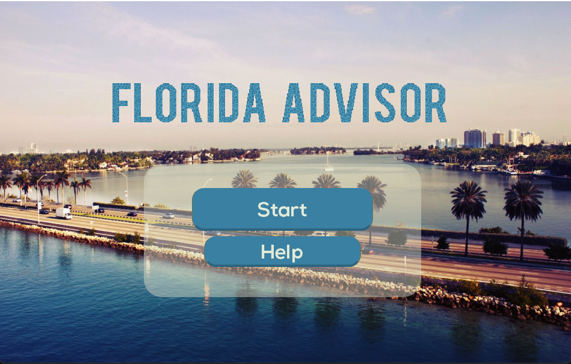
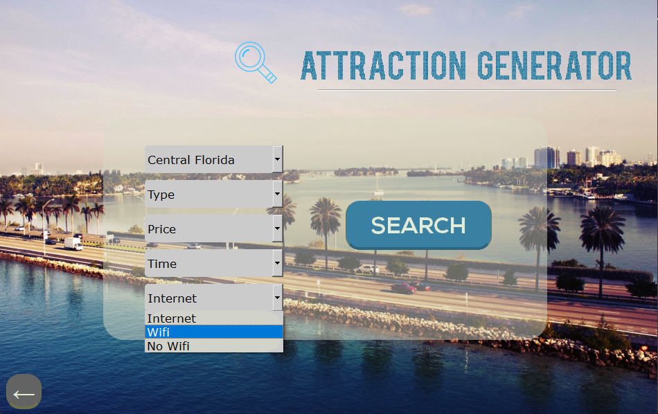
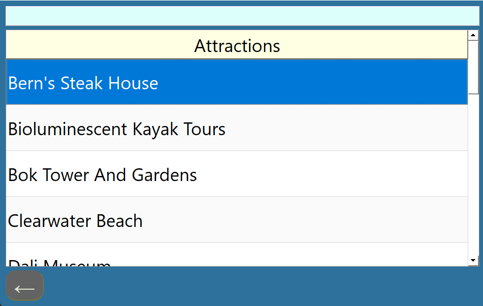
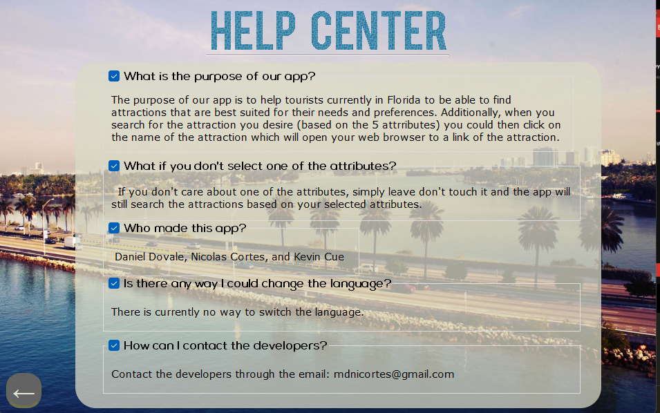

<!-- ABOUT THE PROJECT -->
## About The Project


Florida Advisor is a state-of-the-art PC application tailored specifically for tourists planning a trip to Florida. It offers a streamlined process to discover and plan visits to exciting attractions in the Sunshine State. Here are some key highlights:

* **Tailored for Tourists**: Designed with Florida tourists in mind, it simplifies the process of planning and discovering attractions.
Award-Winning: Proudly secured the 4th place at the national level in the Future Business Leaders of America competition in 2022.
* **Sleek GUI**: Achieved a sleek and intuitive GUI through strategic design and implementation of the PYQT5 library.
* Easy Installation: Engineered a user-friendly installer (exe) file that ensures hassle-free download and installation of the necessary files.
* **Platform Compatibility**: Exclusively designed for Windows users.
* **Tech Stack**: Developed using Python and the PYQT5 library for the GUI interface.

<p align="right">(<a href="#readme-top">back to top</a>)</p>

### Built With

* ![Python]

<p align="right">(<a href="#readme-top">back to top</a>)</p>

<!-- GETTING STARTED -->
## Getting Started

### Prerequisites

In order to run the program through the python file you must install
* [Python 3.10.5](https://www.python.org/downloads/release/python-3105/)

* PyQt5
  ```cmd
  pip install PyQt5
  ```

### Installation

_We include an the Florida Advisor Installer.exe file to install the program though by cloning the git you get all the same necessary files_

1. Clone the repo
   ```sh
   git clone https://github.com/d-dovale/Florida-Advisor
   ```
3. Run the exe
   ```sh
   Florida Advisor.exe
   ```
4. Or you could also run the main python file
   ```Python
   main.py
   ```

<p align="right">(<a href="#readme-top">back to top</a>)</p>


<!-- USAGE EXAMPLES -->
## Pictures






<!-- CONTACT -->
## Contact

Daniel Dovale - ddovale2004@gmail.com

Nicolas Cortes- lieutenantoj@gmail.com

Kevin Cue - kcue2504@gmail.com

<p align="right">(<a href="#readme-top">back to top</a>)</p>


<!-- ACKNOWLEDGMENTS -->
## Acknowledgments

* [Animated Text Generator](https://textanim.com/)
* [Nexa Font](https://www.fontfabric.com/fonts/nexa/)


<p align="right">(<a href="#readme-top">back to top</a>)</p>


<!-- MARKDOWN LINKS & IMAGES -->
<!-- https://www.markdownguide.org/basic-syntax/#reference-style-links -->
[contributors-shield]: https://img.shields.io/github/contributors/othneildrew/Best-README-Template.svg?style=for-the-badge
[contributors-url]: https://github.com/othneildrew/Best-README-Template/graphs/contributors
[forks-shield]: https://img.shields.io/github/forks/othneildrew/Best-README-Template.svg?style=for-the-badge
[forks-url]: https://github.com/othneildrew/Best-README-Template/network/members
[stars-shield]: https://img.shields.io/github/stars/othneildrew/Best-README-Template.svg?style=for-the-badge
[stars-url]: https://github.com/othneildrew/Best-README-Template/stargazers
[issues-shield]: https://img.shields.io/github/issues/othneildrew/Best-README-Template.svg?style=for-the-badge
[issues-url]: https://github.com/othneildrew/Best-README-Template/issues
[license-shield]: https://img.shields.io/github/license/othneildrew/Best-README-Template.svg?style=for-the-badge
[license-url]: https://github.com/othneildrew/Best-README-Template/blob/master/LICENSE.txt
[linkedin-shield]: https://img.shields.io/badge/-LinkedIn-black.svg?style=for-the-badge&logo=linkedin&colorB=555
[linkedin-url]: https://linkedin.com/in/othneildrew
[product-screenshot]: images/screenshot.png
[Next.js]: https://img.shields.io/badge/next.js-000000?style=for-the-badge&logo=nextdotjs&logoColor=white
[Next-url]: https://nextjs.org/
[React.js]: https://img.shields.io/badge/React-20232A?style=for-the-badge&logo=react&logoColor=61DAFB
[Python]: https://img.shields.io/badge/Python-3776AB?style=for-the-badge&logo=python&logoColor=white
[React-url]: https://reactjs.org/
[Vue.js]: https://img.shields.io/badge/Vue.js-35495E?style=for-the-badge&logo=vuedotjs&logoColor=4FC08D
[Vue-url]: https://vuejs.org/
[Angular.io]: https://img.shields.io/badge/Angular-DD0031?style=for-the-badge&logo=angular&logoColor=white
[Angular-url]: https://angular.io/
[Svelte.dev]: https://img.shields.io/badge/Svelte-4A4A55?style=for-the-badge&logo=svelte&logoColor=FF3E00
[Svelte-url]: https://svelte.dev/
[Laravel.com]: https://img.shields.io/badge/Laravel-FF2D20?style=for-the-badge&logo=laravel&logoColor=white
[Laravel-url]: https://laravel.com
[Bootstrap.com]: https://img.shields.io/badge/Bootstrap-563D7C?style=for-the-badge&logo=bootstrap&logoColor=white
[Bootstrap-url]: https://getbootstrap.com
[JQuery.com]: https://img.shields.io/badge/jQuery-0769AD?style=for-the-badge&logo=jquery&logoColor=white
[JQuery-url]: https://jquery.com 
